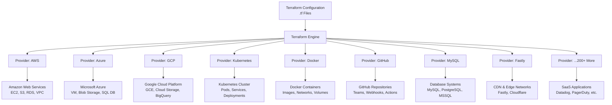

# **Terraform: Your Universal Infrastructure Connector**


## **Multi-Cloud & Hybrid Infrastructure Orchestration**

### **Terraform's Multi-Cloud Architecture**



---

## **How Terraform Manages Everything**

### **Single Workflow, Multiple Platforms**

**Traditional Approach:**
```
AWS Console → Manual Clicks
Azure Portal → More Clicks
K8s CLI → Complex Commands
GitHub UI → Separate Setup
Database → Different Tools
→ Inconsistent, Error-Prone
```

**Terraform Approach:**
```
Single .tf File → terraform apply
→ Everything Deployed Consistently
→ Version Controlled
→ Repeatable
→ Automated
```

---

## **Real-World Multi-Cloud Example**

```hcl
# main.tf - Single configuration managing multiple clouds

# AWS Resources
resource "aws_instance" "web_server" {
  ami           = "ami-0c55b159cbfafe1f0"
  instance_type = "t2.micro"
  subnet_id     = aws_subnet.public.id
}

resource "aws_s3_bucket" "assets" {
  bucket = "my-app-assets"
}

# Azure Resources
resource "azurerm_virtual_machine" "app_server" {
  name                  = "app-vm"
  location              = "East US"
  resource_group_name   = azurerm_resource_group.main.name
  vm_size               = "Standard_B1s"
  
  storage_image_reference {
    publisher = "Canonical"
    offer     = "UbuntuServer"
    sku       = "16.04-LTS"
  }
}

# Google Cloud Resources
resource "google_compute_instance" "analytics" {
  name         = "analytics-vm"
  machine_type = "e2-micro"
  zone         = "us-central1-a"
  
  boot_disk {
    initialize_params {
      image = "ubuntu-os-cloud/ubuntu-2004-lts"
    }
  }
}

# Kubernetes Resources
resource "kubernetes_deployment" "microservice" {
  metadata {
    name = "api-service"
  }
  
  spec {
    replicas = 3
    
    selector {
      match_labels = {
        app = "api"
      }
    }
    
    template {
      metadata {
        labels = {
          app = "api"
        }
      }
      
      spec {
        container {
          image = "myapp/api:latest"
          name  = "api"
        }
      }
    }
  }
}

# Database (Cloud SQL)
resource "google_sql_database_instance" "main" {
  name             = "main-instance"
  database_version = "POSTGRES_13"
  
  settings {
    tier = "db-f1-micro"
  }
}

# DNS (Cloudflare)
resource "cloudflare_record" "www" {
  zone_id = var.cloudflare_zone_id
  name    = "www"
  value   = aws_instance.web_server.public_ip
  type    = "A"
  ttl     = 3600
}

# Monitoring (Datadog)
resource "datadog_monitor" "latency" {
  name    = "High Latency Alert"
  type    = "metric alert"
  message = "Latency is too high"
  
  query = "avg(last_5m):avg:aws.elb.latency{*} > 100"
}

# All connected, all managed from one place!
```

---

## **Terraform's Provider Ecosystem**

### **Categories of Providers:**

| **Category** | **Examples** | **Use Case** |
|-------------|-------------|-------------|
| **Cloud Providers** | AWS, Azure, GCP, Oracle, Alibaba | Compute, Storage, Networking |
| **Container Orchestration** | Kubernetes, Docker, Nomad | Container management & orchestration |
| **Infrastructure Services** | VMware, Proxmox, OpenStack | On-premises virtualization |
| **Network & DNS** | Cloudflare, Fastly, NS1 | DNS, CDN, Load Balancing |
| **Database & Storage** | MySQL, PostgreSQL, MongoDB | Database provisioning |
| **Monitoring & Observability** | Datadog, New Relic, Splunk | Monitoring setup |
| **Version Control** | GitHub, GitLab, Bitbucket | Repository & CI/CD setup |
| **Communication** | Slack, PagerDuty, Twilio | Alerts & notifications |
| **Security** | Vault, AWS KMS, Azure Key Vault | Secrets management |
| **SaaS Applications** | Salesforce, ServiceNow | Business application config |

---

## **The Magic: Resource Graph**

Terraform builds a **dependency graph** of all resources:
```
GitHub Repo (1)
    ↓
AWS VPC (2) ← GCP VPC (3)
    ↓            ↓
AWS Subnet (4)  GCP Subnet (5)
    ↓            ↓
EC2 Instance (6) ↔ GCE Instance (7)
    ↓                    ↓
Kubernetes Cluster (8) ← Database (9)
    ↓
Docker Containers (10)
```

**Key Insight:** Terraform understands that the database must be created before Kubernetes can connect to it, and the VPC must exist before subnets can be created—**automatically**.

---

## **Benefits of This Approach**

### **🔄 Consistent Workflow**
One command (`terraform apply`) for:
- Cloud VMs
- Kubernetes pods
- Database schemas
- DNS records
- Monitoring dashboards
- User permissions

### **🔗 Cross-Cloud Dependencies**
```hcl
# AWS Load Balancer pointing to Azure VMs
resource "aws_lb" "main" {
  # AWS resource
}

resource "azurerm_network_interface" "app" {
  # Azure resource
  ip_configuration {
    load_balancer_backend_address_pools_ids = [aws_lb.main.arn]
    # Cross-cloud reference!
  }
}
```

### **📊 Unified State Management**
```bash
terraform state list
# Output shows ALL resources across ALL providers:
# aws_instance.web_server
# azurerm_virtual_machine.app
# kubernetes_deployment.api
# google_sql_database_instance.db
# cloudflare_record.www
```

---

## **Getting Started with Multi-Cloud Terraform**

### **Step 1: Configure Multiple Providers**
```hcl
terraform {
  required_providers {
    aws = {
      source  = "hashicorp/aws"
      version = "~> 5.0"
    }
    azurerm = {
      source  = "hashicorp/azurerm"
      version = "~> 3.0"
    }
    google = {
      source  = "hashicorp/google"
      version = "~> 4.0"
    }
  }
}

provider "aws" {
  region = "us-east-1"
}

provider "azurerm" {
  features {}
}

provider "google" {
  project = "my-gcp-project"
  region  = "us-central1"
}
```

### **Step 2: Define Multi-Cloud Architecture**
```hcl
# Hybrid architecture example
module "aws_network" {
  source = "./modules/aws-vpc"
  # AWS networking
}

module "azure_network" {
  source = "./modules/azure-vnet"
  # Azure networking
}

resource "aws_vpn_connection" "to_azure" {
  # Connect AWS to Azure
  vpn_gateway_id = module.aws_network.vpn_gw_id
  customer_gateway_id = azurerm_virtual_network_gateway.aws.customer_gateway_id
}

resource "azurerm_virtual_network_gateway" "aws" {
  # Azure side of VPN
  # ...
}
```

---

## **Real Use Cases**

### **Case 1: Disaster Recovery**
```
Primary Region (AWS):
Terraform → EC2 + RDS + S3

Backup Region (Azure):
Terraform → VM + SQL DB + Blob Storage

Single config manages both, with failover automation.
```

### **Case 2: Best-of-Breed Architecture**
```
AWS (Best for Lambda) → Serverless functions
GCP (Best for Big Data) → BigQuery analytics
Azure (Best for .NET) → Windows applications
Kubernetes (Portable) → Microservices
```

### **Case 3: Gradual Migration**
```
Phase 1: Terraform manages old + new
Phase 2: Cut traffic to new
Phase 3: Decommission old
→ Zero-downtime migrations
```

---

## **Visual Summary**

```
┌─────────────────────────────────────────────────────┐
│                TERRAFORM CONTROL PLANE               │
├─────────────────────────────────────────────────────┤
│  Write Once → Apply Everywhere → Manage Everything  │
└──────────────────────────┬──────────────────────────┘
                           │
        ┌──────────────────┼──────────────────┐
        │                  │                  │
    ┌───▼────┐        ┌───▼────┐        ┌───▼────┐
    │  AWS   │        │ Azure  │        │  GCP   │
    │ EC2/S3 │        │ VM/AD  │        │ GCE/GCS│
    └────────┘        └────────┘        └────────┘
        │                  │                  │
    ┌───▼────┐        ┌───▼────┐        ┌───▼────┐
    │K8s(AWS)│        │K8s(AZ) │        │K8s(GCP)│
    └────────┘        └────────┘        └────────┘
        │                  │                  │
        └──────────────────┼──────────────────┘
                           │
                    ┌──────▼──────┐
                    │ Applications│
                    │ DBs | DNS   │
                    │ CDN | Auth  │
                    └─────────────┘
                    
      One Terraform State to Rule Them All! ✅
```

---

## **Key Takeaway**

**Terraform isn't just for cloud infrastructure.** It's a **universal configuration engine** that can manage:
- ☁️ Multiple clouds simultaneously
- 🐳 Container platforms
- 🗄️ Databases
- 🌐 Networking & DNS
- 🔐 Security policies
- 📊 Monitoring tools
- 👥 User access
- 🔗 And everything in between

**From a single VM to an entire global, multi-cloud enterprise architecture**—all defined as code, all version controlled, all managed through one consistent workflow.

**Your infrastructure just became portable, repeatable, and truly cloud-agnostic!** 🚀
